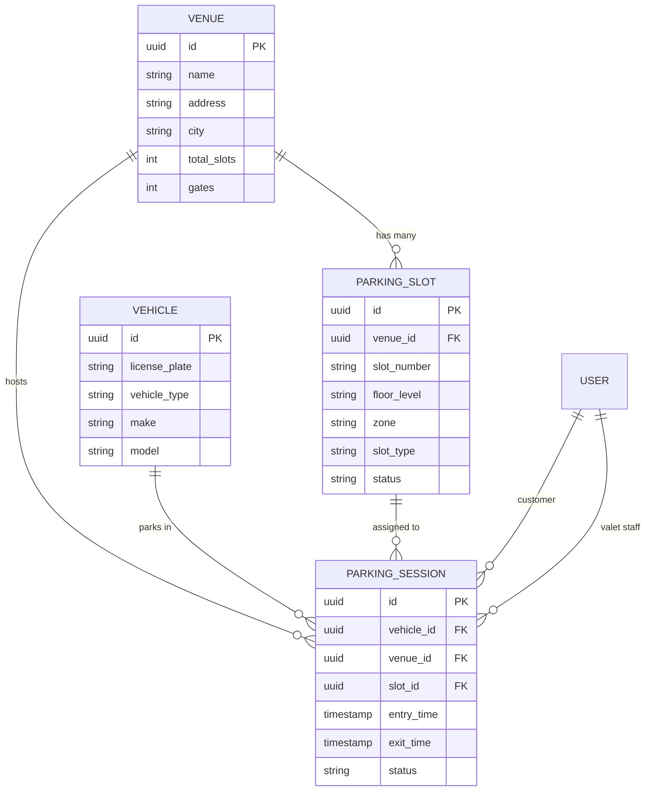
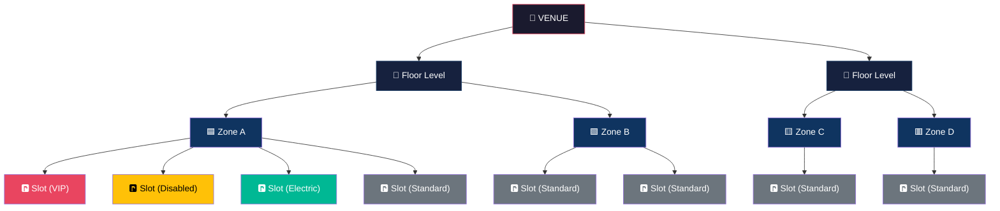
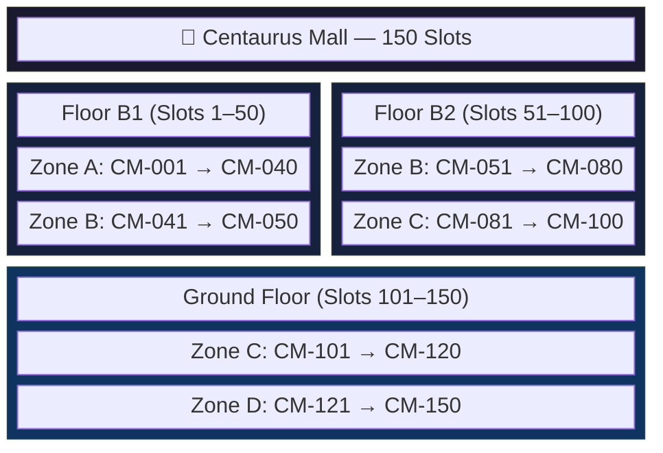
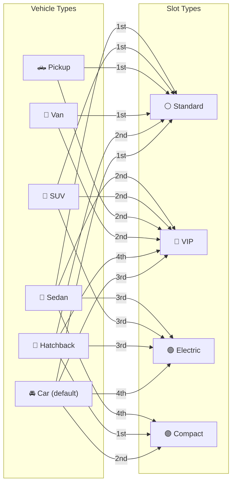
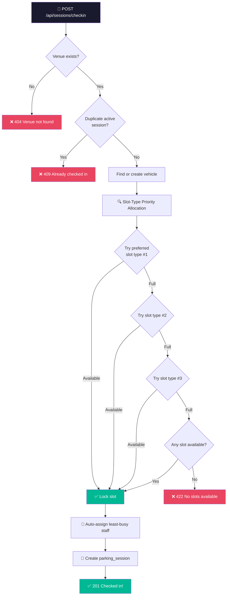

# ParkFlow — Parking Structure Architecture

This document explains how **Venues**, **Floor Levels**, **Zones**, **Slot Types**, and **Vehicle Types** relate to each other in ParkFlow.

---

## 1. Entity Relationship Overview



---

## 2. Hierarchy: Venue → Floor → Zone → Slot

Every parking slot lives inside a **venue** and is organized into a **floor level** and a **zone**. Each slot also has a **slot type** that determines which vehicle types prefer it.



---

## 3. Centaurus Mall — Slot Distribution (150 Slots)

### 3.1 Floor-Level Breakdown

| Floor Level | Slot Range      | Count |
|-------------|-----------------|-------|
| **B1**      | CM-001 → CM-050 | 50    |
| **B2**      | CM-051 → CM-100 | 50    |
| **Ground**  | CM-101 → CM-150 | 50    |

### 3.2 Zone Breakdown

| Zone       | Slot Range      | Count |
|------------|-----------------|-------|
| **Zone A** | CM-001 → CM-040 | 40    |
| **Zone B** | CM-041 → CM-080 | 40    |
| **Zone C** | CM-081 → CM-120 | 40    |
| **Zone D** | CM-121 → CM-150 | 30    |

### 3.3 Slot-Type Breakdown

| Slot Type    | Slot Range      | Count | Color   |
|--------------|-----------------|-------|---------|
| **VIP**      | CM-001 → CM-010 | 10    | 🔴 Red  |
| **Disabled** | CM-011 → CM-015 | 5     | 🟡 Gold |
| **Electric** | CM-016 → CM-025 | 10    | 🟢 Green|
| **Standard** | CM-026 → CM-150 | 125   | ⚪ Gray |

### 3.4 Visual Map — Centaurus Mall



### 3.5 Slot Types on Floor B1 (Detailed)

```
Floor B1 — Slots CM-001 to CM-050
┌─────────────────────────────────────────────────────────────────────┐
│  ZONE A (CM-001 → CM-040)                                         │
│  ┌────────┐ ┌────────┐ ┌──────────┐ ┌──────────────────────────┐  │
│  │  VIP   │ │DISABLED│ │ ELECTRIC │ │       STANDARD           │  │
│  │001–010 │ │011–015 │ │ 016–025  │ │       026–040            │  │
│  │ 10 slots│ │ 5 slots│ │ 10 slots │ │       15 slots           │  │
│  │  🔴    │ │  🟡    │ │   🟢    │ │        ⚪               │  │
│  └────────┘ └────────┘ └──────────┘ └──────────────────────────┘  │
│                                                                     │
│  ZONE B (CM-041 → CM-050)                                         │
│  ┌──────────────────────────────────────────────────────────────┐  │
│  │                     STANDARD (041–050) — 10 slots  ⚪        │  │
│  └──────────────────────────────────────────────────────────────┘  │
└─────────────────────────────────────────────────────────────────────┘
```

---

## 4. Riphah University — Slot Distribution (100 Slots)

### 4.1 Floor-Level Breakdown

| Floor Level | Slot Range      | Count |
|-------------|-----------------|-------|
| **Ground**  | RU-001 → RU-100 | 100   |

> Single-floor venue — all slots are on Ground level.

### 4.2 Zone Breakdown

| Zone       | Slot Range      | Count |
|------------|-----------------|-------|
| **Zone A** | RU-001 → RU-025 | 25    |
| **Zone B** | RU-026 → RU-050 | 25    |
| **Zone C** | RU-051 → RU-075 | 25    |
| **Zone D** | RU-076 → RU-100 | 25    |

### 4.3 Slot-Type Breakdown

| Slot Type    | Slot Range      | Count |
|--------------|-----------------|-------|
| **Disabled** | RU-001 → RU-005 | 5     |
| **Electric** | RU-006 → RU-010 | 5     |
| **Standard** | RU-011 → RU-100 | 90    |

### 4.4 Visual Map — Riphah University

```
Ground Floor — 100 Slots
┌──────────────────────────────────────────────────────────────────────────┐
│                                                                          │
│  Zone A (RU-001 → RU-025)                                               │
│  ┌──────────┐ ┌──────────┐ ┌────────────────────────────────────────┐   │
│  │ DISABLED │ │ ELECTRIC │ │           STANDARD                     │   │
│  │ 001–005  │ │ 006–010  │ │           011–025                     │   │
│  │  5 slots │ │  5 slots │ │           15 slots                    │   │
│  │   🟡     │ │   🟢     │ │            ⚪                        │   │
│  └──────────┘ └──────────┘ └────────────────────────────────────────┘   │
│                                                                          │
│  Zone B (RU-026 → RU-050)         All STANDARD — 25 slots  ⚪          │
│  Zone C (RU-051 → RU-075)         All STANDARD — 25 slots  ⚪          │
│  Zone D (RU-076 → RU-100)         All STANDARD — 25 slots  ⚪          │
│                                                                          │
└──────────────────────────────────────────────────────────────────────────┘
```

---

## 5. Vehicle-Type → Slot-Type Priority Allocation

When a car checks in, ParkFlow tries to assign a slot matching the vehicle type in **priority order**. If the preferred slot type is full, it falls back to the next option.



### Priority Table

| Vehicle Type | 1st Choice   | 2nd Choice | 3rd Choice | 4th Choice |
|:------------|:-------------|:-----------|:-----------|:-----------|
| **Sedan**    | Standard     | VIP        | Electric   | Compact    |
| **SUV**      | Standard     | VIP        | Electric   | —          |
| **Pickup**   | Standard     | VIP        | —          | —          |
| **Van**      | Standard     | VIP        | —          | —          |
| **Hatchback**| Compact      | Standard   | Electric   | VIP        |
| **Car**      | Standard     | Compact    | VIP        | Electric   |

> If **all** preferred slot types are full, the system tries **any available slot** as a last resort.

---

## 6. Check-In Flow



---

## 7. Slot Statuses

| Status       | Meaning                                  |
|-------------|------------------------------------------|
| `available` | Slot is free and can be assigned          |
| `occupied`  | A vehicle is currently parked in the slot |

When a vehicle **checks in**, the slot flips to `occupied`.  
When a vehicle **checks out**, the slot flips back to `available`.

---

## 8. Summary Table — All Venues

| Venue              | Total Slots | Floors          | Zones        | Slot Types                          |
|--------------------|-------------|-----------------|--------------|-------------------------------------|
| Centaurus Mall     | 150         | B1, B2, Ground  | A, B, C, D   | VIP, Disabled, Electric, Standard   |
| Islamabad Airport  | 300         | (not seeded)    | (not seeded) | (not seeded)                        |
| Riphah University  | 100         | Ground          | A, B, C, D   | Disabled, Electric, Standard        |
